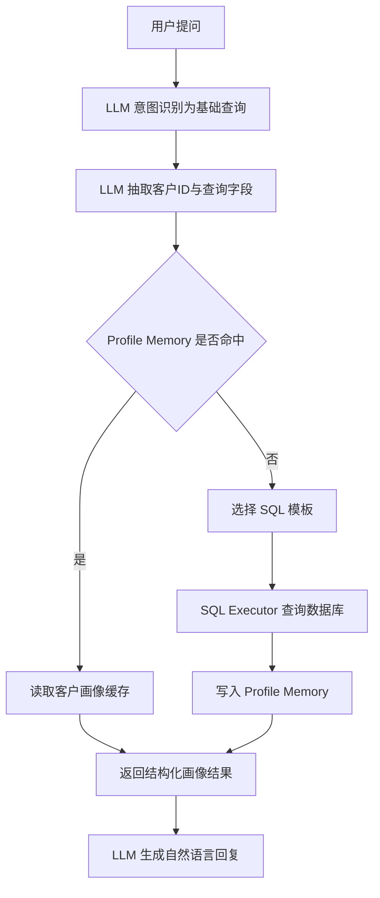
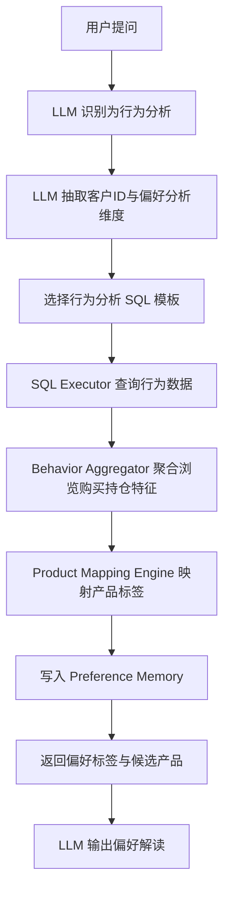
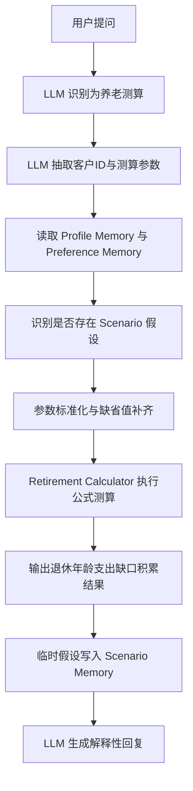
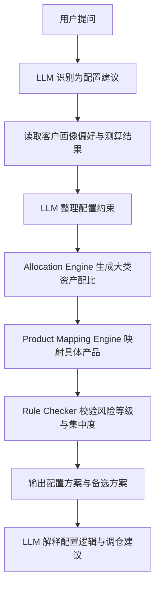
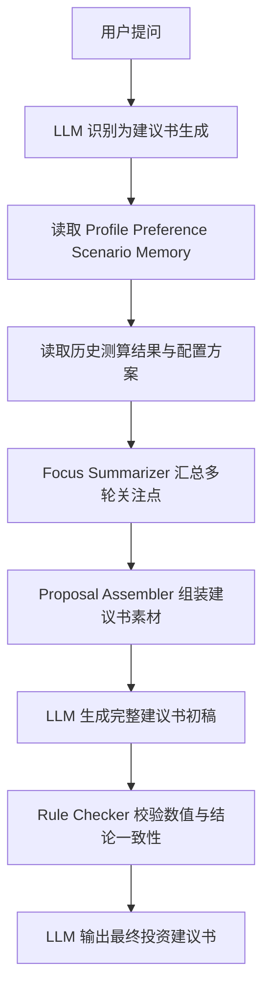
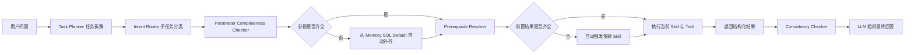

# 任务 2 养老规划 Agent 建设实现方案

## 1. 文档目标

本文档给出一套面向赛题 `任务 2：养老规划 Agent 建设` 的完整实现方案，目标是设计一个可落地、可评测、可扩展的养老规划 Agent，帮助客户经理（RM）围绕客户 KYC、缺口测算、资产配置和建议书生成四个环节，完成高质量、低时延、低 Token 消耗的智能服务。

方案重点围绕以下五个目标展开：

1. `答得对`：严格满足题目中的数值计算、SQL 查询、产品映射、上下文记忆和建议书要求。
2. `答得快`：通过意图路由、模板化 SQL、轻量状态管理和缓存机制降低平均响应时延。
3. `答得省`：通过结构化中间表示、短链路工具调用和压缩式上下文管理降低 Token 消耗。
4. `答得稳`：将高风险数值逻辑从大模型中剥离，交由确定性计算引擎执行，避免口算和漂移。
5. `便于扩展`：采用 Agent + Skill + Tool 的模块化架构，后续可平滑扩展产品库、客户标签和策略规则。

---

## 2. 题目理解与关键约束

根据赛题要求，Agent 不是一个简单问答机器人，而是一个围绕养老规划 SOP 设计的任务型智能体。它至少需要同时具备以下能力：

### 2.1 业务能力

1. 查询客户基础画像信息。
2. 分析客户历史行为偏好，并映射到题目给定的产品库。
3. 进行退休年龄、退休时支出、养老金缺口、退休资产积累等测算。
4. 根据客户风险等级、人生阶段和行为偏好生成资产配置方案。
5. 汇总客户在多轮对话中的关注点，输出完整投资建议书。

### 2.1.1 五项业务的 LLM 与工具调用流程

为了兼顾正确率、时延和 Token 成本，这 5 项业务统一遵循一个原则：

1. `LLM` 负责理解问题、抽取参数、选择 Skill、组织回复。
2. `Tool` 负责查库、计算、规则匹配、优化求解、记忆读写。
3. `最终答案` 由 LLM 基于结构化结果生成，避免大模型直接“拍脑袋”给数值或产品。

#### 业务一：查询客户基础画像信息

`LLM` 主要负责识别这是基础查询类问题，抽取 `customer_id`、所需字段和统计口径；`Tool` 负责优先读取 `Profile Memory`，未命中时再调用 SQL 模板查询数据库，并把结果回写缓存。



推荐拆分为以下步骤：

1. `Intent Router` 将问题归类为 `customer_profile_query`。
2. `Parameter Extractor` 抽取客户编号、字段名、过滤条件。
3. `Memory Tool` 先检查该客户基础信息是否已有缓存。
4. 若缓存未命中，`SQL Generator` 按模板生成 SQL，`SQL Executor` 执行查询。
5. `LLM Answer Composer` 将结构化结果转成口语化回答。

#### 业务二：分析客户历史行为偏好并映射产品库

`LLM` 负责理解“偏好”问题的分析维度，例如浏览偏好、购买偏好、风险偏好、期限偏好；`Tool` 负责从行为流水中做聚合统计，再用规则引擎把行为标签映射到题目产品库。



推荐拆分为以下步骤：

1. `Intent Router` 将问题归类为 `behavior_analysis`。
2. `SQL Tool` 查询客户浏览、点击、购买、持有、赎回等行为数据。
3. `Behavior Aggregator` 生成中间标签，例如 `偏固收`、`偏中低波动`、`偏短久期`、`关注流动性`。
4. `Product Mapping Engine` 按规则将标签映射到题目给定产品库中的产品类别或候选产品。
5. `LLM` 对“为什么判断为该偏好、为什么推荐这些产品”做解释，并把稳定偏好写入 `Preference Memory`。

#### 业务三：退休测算

`LLM` 负责抽取测算参数与临时假设，例如退休年龄、通胀率、替代率、当前月支出、目标养老生活水平；`Tool` 负责做所有公式计算并返回可复现结果，避免大模型直接算数。



推荐拆分为以下步骤：

1. `Intent Router` 将问题归类为 `retirement_calculation`。
2. `LLM` 从问题中抽取显式参数，并从 `Profile Memory`、`Preference Memory` 中补充缺失参数。
3. 若用户说“如果、假设、假如”，则只写入 `Scenario Memory`，不污染长期偏好。
4. `Retirement Calculator Tool` 执行退休年龄、退休时支出、养老金缺口、退休资产积累等公式。
5. `LLM` 输出结果时同时给出解释，例如“缺口为什么形成、哪个参数最敏感、如果提高每月定投会怎样变化”。

#### 业务四：生成资产配置方案

`LLM` 负责把客户风险等级、人生阶段、行为偏好和养老缺口整合成配置约束；`Tool` 负责根据规则和约束做资产配置求解，并映射到题目产品库。



推荐拆分为以下步骤：

1. `Intent Router` 将问题归类为 `allocation_planning`。
2. `Memory Tool` 读取 `Profile Memory`、`Preference Memory` 和最近一次 `Retirement Calculation` 结果。
3. `LLM Constraint Builder` 形成约束条件，例如风险等级上限、目标收益、流动性要求、养老缺口补足强度。
4. `Allocation Engine` 先给出大类资产配置比例，如现金管理、固收、权益、养老目标产品。
5. `Product Mapping Engine` 再从题目产品库选择具体产品。
6. `Rule Checker` 检查是否违反风险适配、集中度、人生阶段匹配等约束。
7. `LLM` 负责解释“为什么这样配、偏稳健还是偏进取、如果客户更看重流动性应如何调整”。

#### 业务五：生成完整投资建议书

`LLM` 负责统筹全文结构、汇总多轮对话中的关注点、生成最终文案；`Tool` 负责提供建议书所需的所有结构化素材，包括画像、偏好、测算、配置和历史关注点摘要。



推荐拆分为以下步骤：

1. `Intent Router` 将问题归类为 `proposal_generation`。
2. `Session Memory Tool` 读取多轮对话中沉淀的事实、偏好、假设与关注点。
3. `Focus Summarizer` 识别高频关注项，例如退休年龄、生活质量、流动性、风险承受能力、长寿风险。
4. `Proposal Assembler` 把客户画像、行为偏好、养老测算结果、资产配置方案整合为统一 JSON。
5. `LLM Proposal Writer` 基于模板生成建议书，常见结构包括：
   - 客户基本情况
   - 养老目标与核心假设
   - 养老金缺口分析
   - 推荐配置方案
   - 风险提示与后续建议
6. `Consistency Checker` 检查建议书中的数值、产品和结论是否与工具结果一致。

#### 五项业务的统一主流程

从系统架构上看，这 5 项业务可以抽象成同一条总链路，只是中间调用的 Skill 和 Tool 不同：


这样设计的好处是：

1. `查询`、`测算`、`配置` 三类高风险环节都由工具保证稳定性。
2. `偏好理解`、`话术解释`、`建议书生成` 由 LLM 发挥语言和归纳优势。
3. 所有业务都复用统一的 `Memory + Router + Tool` 框架，便于比赛场景下快速实现和调优。

### 2.2 技术约束

1. 必须通过 `生成 SQL 并访问数据库` 的方式获取客户信息，不能把全量数据拉到本地做统一分析。
2. 数值计算结果必须稳定、可解释、可复现，且取整规则严格一致。
3. 需要区分 `假设` 与 `观点`：
   - `假设/如果/假如` 只作用于当前问题，不写入长期会话状态。
   - `认为/想要/预期` 代表客户偏好或目标，应进入长期会话记忆。
4. 需要兼顾正确率、时延、Token 成本，因此不能过度依赖长 prompt 或多轮链式思考。

### 2.3 评分导向

本题 70 分中：

1. `50 分` 来自回答质量。
2. `10 分` 来自回答耗时。
3. `10 分` 来自 Token 消耗。

因此最优方案不是“最复杂的大模型方案”，而是“规则、SQL 和计算引擎优先，大模型负责理解、编排和生成”的混合架构。

---

## 3. 总体方案概览

### 3.1 总体设计思路

采用 `Task Planner + Router Agent + 流程守卫模块 + 专项 Skill + 确定性工具引擎` 的架构。

大模型只负责三类工作：

1. 将用户问题拆解为标准子任务。
2. 识别每个子任务的意图并选择需要调用的 Skill。
3. 将工具返回结果组织为自然语言答案或建议书。

所有对正确率敏感的工作都交给工具层：

1. 数据查询由 `SQL Tool` 负责。
2. 数值测算由 `Retirement Calculator Tool` 负责。
3. 产品映射和配置求解由 `Allocation Engine Tool` 负责。
4. 会话记忆由 `Session Memory Tool` 负责。
5. 参数补齐由 `Parameter Completeness Checker` 负责。
6. 依赖补跑由 `Prerequisite Resolver` 负责。
7. 输出校验由 `Consistency Checker` 负责。

### 3.2 架构图

```text
用户问题
  ↓
Task Planner（任务拆解 / 顺序规划）
  ↓
Intent Router（子任务意图识别 / 问题分类）
  ↓
Flow Guard（参数检查 / 依赖补齐）
  ↓
Skill Dispatcher（技能路由）
  ├─ Customer Profile Skill
  ├─ Behavior Analysis Skill
  ├─ Retirement Calculation Skill
  ├─ Allocation Planning Skill
  └─ Proposal Writer Skill
  ↓
Tools
  ├─ SQL Generator + SQL Executor
  ├─ Parameter Completeness Checker
  ├─ Prerequisite Resolver
  ├─ Retirement Formula Engine
  ├─ Product Mapping Engine
  ├─ Allocation Optimizer
  └─ Session Memory Manager
  ↓
结构化结果
  ↓
Consistency Checker
  ↓
Answer Composer / Proposal Generator
  ↓
最终回复
```

### 3.3 为什么这样设计

1. 题目明确要求 SQL 访问数据库，因此必须显式建设数据库访问层。
2. 题目对数值误差要求严格，因此必须将公式计算做成独立模块。
3. 题目存在多轮对话记忆要求，因此必须将“客户事实、客户观点、临时假设”拆开管理。
4. 建议书类题目占分高，因此需要独立的建议书生成 Skill，复用前序分析结果，避免重复查询和重复计算。
5. 题目存在复合任务和多轮追问，因此需要 `Task Planner` 先统一拆解任务链，而不是只做单轮意图分类。
6. 题目对结果稳定性要求高，因此需要在 Skill 执行前后分别加入 `参数完备性检查`、`前置条件补齐` 和 `一致性校验`。

### 3.4 优化后主流程

在高优先级优化方案下，系统主流程升级为：



这条链路的核心目标不是增加流程复杂度，而是用更强的流程控制减少漏答、补值错误和文案不一致问题。

---

## 4. 系统模块设计

## 4.0 Orchestration Layer：任务规划与流程守卫

这一层位于 `Skill Dispatcher` 之前，负责把用户原始问题转成“可执行、可校验、可补齐”的任务链路，是提升题目契合度与鲁棒性的关键。

### 4.0.1 Task Planner：任务拆解器

#### 目标

将用户问题先拆解成一组有顺序的标准子任务，特别适合处理：

1. 复合问题，例如“先分析偏好，再算缺口，再给配置建议”。
2. 多轮追问，例如“按前面目标重新算，并同步更新建议书”。
3. 高层目标问题，例如“直接生成完整养老建议书”。

#### 输出格式

```json
{
  "customer_id": "V500001",
  "tasks": [
    {"step": 1, "type": "customer_profile"},
    {"step": 2, "type": "behavior_analysis"},
    {"step": 3, "type": "retirement_calculation"},
    {"step": 4, "type": "allocation_planning"},
    {"step": 5, "type": "proposal_generation"}
  ]
}
```

#### 价值

1. 将养老规划 Agent 从“单问题应答”提升为“围绕养老规划 SOP 的任务执行器”。
2. 避免单纯依赖关键词路由造成漏步骤。
3. 便于多轮会话中复用已有中间结果。

### 4.0.2 Parameter Completeness Checker：参数完备性检查器

#### 目标

在进入测算或配置前，先检查参数是否完整，并显式区分参数来源。

#### 参数来源优先级

1. `Profile Memory / SQL`
   客观事实优先从数据库或缓存读取。
2. `Preference Memory`
   稳定目标和长期偏好从长期记忆读取。
3. `Scenario Memory`
   当前轮临时假设仅用于本轮测算。
4. `Default Config`
   题目默认参数，例如通胀率、寿命假设、收益率。

#### 输出格式

```json
{
  "ready_params": {"age": 22, "gender": "男", "monthly_expend": 4000},
  "fillable_from_memory": ["retirement_goal_amount"],
  "fillable_from_sql": ["net_asset", "pension"],
  "fillable_from_default": ["inflation_annual"],
  "must_ask_user": []
}
```

#### 价值

1. 避免模型隐式补值。
2. 保证数值链路口径一致。
3. 为后续解释性回复和建议书成文提供可靠来源。

### 4.0.3 Prerequisite Resolver：前置条件自动补齐器

#### 目标

在当前 Skill 执行前检查依赖结果是否存在，若不存在则自动补跑前置 Skill。

#### 依赖关系示例

1. `customer_profile`
   仅依赖 `customer_id`。
2. `behavior_analysis`
   依赖 `customer_id`。
3. `retirement_calculation`
   依赖 `profile`。
4. `allocation_planning`
   依赖 `profile + behavior_analysis + retirement_calculation`。
5. `proposal_generation`
   依赖 `profile + behavior_analysis + retirement_calculation + allocation_planning`。

#### 价值

1. 用户无需显式知道内部执行顺序。
2. 建议书和配置方案天然具备前序依据。
3. 能显著降低复杂问题中的状态缺失问题。

### 4.0.4 Consistency Checker：一致性校验器

#### 目标

在最终答案输出前，对结构化结果和文案草稿做程序级一致性校验。

#### 校验范围

1. `数值一致性`
   关键金额、比例、年限必须与工具结果一致。
2. `产品一致性`
   推荐产品必须属于题目给定产品库。
3. `风险一致性`
   推荐方案必须满足客户风险等级和生命周期约束。
4. `关注点一致性`
   建议书必须显式回应前序对话中的关注点。

#### 价值

1. 拦截“工具结果正确，但生成文案走样”的问题。
2. 尤其适合建议书类高分题型。
3. 进一步提升最终输出的可信度和严谨性。

## 4.1 Intent Router：问题识别与路由

### 4.1.1 目标

将用户问题快速识别为以下 6 类之一：

1. `基础查询类`
   例如年龄、收入、净资产、风险评级、客户数量统计。
2. `行为分析类`
   例如偏好产品、某类行为次数、某类客户平均年龄。
3. `养老测算类`
   例如距离退休多久、退休时支出多少、养老金缺口多少。
4. `配置建议类`
   例如如何配置资产、哪类产品更适合、缺口如何补足。
5. `建议书生成类`
   例如为某客户生成完整养老规划建议书。
6. `上下文追问类`
   例如“按我刚才说的目标重新算”“结合前面偏好重新给方案”。

### 4.1.2 实现方式

采用 `规则优先 + 小模型补充` 的双层路由：

1. 第一层用关键词规则快速判断，例如：
   - 包含“年龄、收入、多少客户、平均”优先判为查询类。
   - 包含“偏好、浏览、购买、行为”优先判为行为分析类。
   - 包含“退休、缺口、积攒、支出、养老金”优先判为养老测算类。
   - 包含“配置、建议、方案、产品组合”优先判为配置建议类。
   - 包含“建议书、报告、投资建议书”优先判为建议书类。
2. 若规则存在冲突，再由小模型输出结构化分类标签。

### 4.1.3 输出格式

路由结果统一为 JSON：

```json
{
  "task_id": "step_3",
  "intent": "retirement_calculation",
  "customer_id": "V500001",
  "requires_sql": true,
  "requires_memory": true,
  "requires_calculation": true,
  "requires_report": false
}
```

这样后续 Skill 可直接消费，减少多次解析。

---

## 4.2 Session Memory：会话记忆管理

### 4.2.1 记忆类型设计

为满足“区分假设与观点”的要求，设计三层记忆：

1. `Profile Memory`
   来自数据库查询得到的客户客观事实，例如年龄、收入、风险等级。
2. `Preference Memory`
   来自用户表达的稳定偏好和目标，例如“希望退休后生活水平不下降”“偏好稳健”“想 60 岁退休后每月 1.2 万元生活费”。
3. `Scenario Memory`
   来自当前问句中的临时假设，例如“如果通胀率变成 3%”“假设每月多存 2000 元”。

### 4.2.2 记忆写入规则

1. 命中 `如果、假如、假设、设想` 等词，写入 `Scenario Memory`，仅当前轮有效。
2. 命中 `希望、认为、想要、预期、打算、偏好` 等词，写入 `Preference Memory`，后续轮次可继承。
3. 数据库查询结果写入 `Profile Memory`，并可设置 TTL，避免重复查库。

### 4.2.3 记忆结构

```json
{
  "session_id": "xxx",
  "customer_id": "V500001",
  "profile": {
    "age": 22,
    "gender": "男",
    "risk_level": "R3",
    "monthly_income": 5000,
    "monthly_expend": 4000
  },
  "preferences": {
    "retirement_goal": "消费水平不下降",
    "risk_preference_text": "稳健偏平衡",
    "focus_points": ["流动性", "长寿风险"]
  },
  "scenario": {
    "inflation_override": 0.03
  }
}
```

### 4.2.4 评分收益

1. 避免重复提问和重复 SQL 查询，提升速度。
2. 支撑“前序问题中的关注要点汇总到建议书”这一高分要求。
3. 降低上下文重复拼接，节约 Token。

---

## 4.3 SQL Tool：数据库访问层

### 4.3.1 目标

将所有客户数据查询统一收口到 SQL 层，确保满足赛题“必须通过 SQL 调数据库”的要求。

### 4.3.2 数据库设计

建议将两张表导入关系型数据库，例如 SQLite、DuckDB 或 MySQL。考虑到比赛场景为本地评测，优先建议：

1. `DuckDB`
   - 适合本地分析型查询。
   - 对 CSV / Parquet 兼容性好。
   - 聚合和窗口函数性能较好。
2. `SQLite`
   - 部署最轻。
   - 对简单点查和聚合足够。

若上传环境允许携带嵌入式数据库文件，推荐 `DuckDB`。

### 4.3.3 SQL 生成方式

采用 `模板化 SQL + 参数填充`，而不是纯自然语言现写 SQL。

原因：

1. 题目问题类型较固定，模板覆盖率高。
2. 模板方式更稳定、更快、更省 Token。
3. 可显式控制字段名、过滤条件和产品映射规则，降低 SQL 幻觉风险。

### 4.3.4 SQL 模板库示例

#### 模板 A：客户单字段查询

```sql
SELECT {field}
FROM base_table
WHERE user_id = '{user_id}';
```

#### 模板 B：客户计数统计

```sql
SELECT COUNT(*) AS cnt
FROM base_table
WHERE {condition};
```

#### 模板 C：客户平均值统计

```sql
SELECT ROUND(AVG({field}), 6) AS avg_value
FROM base_table
WHERE {condition};
```

#### 模板 D：行为偏好分析

```sql
SELECT mapped_product, COUNT(*) AS cnt
FROM (
    SELECT
        CASE
            WHEN prod_sub_typ = '现金' AND prod_typ = '理财' THEN '现金理财'
            WHEN prod_sub_typ = '一般性' AND prod_typ = '存款' THEN '定期存款'
            WHEN prod_typ IN ('理财', '基金') AND rsk_lvl = 'R2' THEN '短债类产品'
            WHEN prod_typ IN ('理财', '基金') AND rsk_lvl = 'R3' THEN '固收+产品'
            WHEN prod_typ = '基金' AND rsk_lvl IN ('R4', 'R5') THEN '权益类产品'
            WHEN prod_typ = '保险' AND prod_sub_typ IN ('税延养老年金', '养老年金') THEN '年金险'
            ELSE '其他'
        END AS mapped_product
    FROM action_table
    WHERE user_id = '{user_id}'
      AND prod_typ <> '非财富'
) t
GROUP BY mapped_product
ORDER BY cnt DESC
LIMIT 1;
```

#### 模板 E：行为筛选后关联基础表统计

```sql
WITH t AS (
    SELECT user_id, COUNT(*) AS action_cnt
    FROM action_table
    WHERE {behavior_condition}
    GROUP BY user_id
    HAVING COUNT(*) >= {min_cnt}
)
SELECT ROUND(AVG(b.age), 6) AS avg_age
FROM t
JOIN base_table b
  ON t.user_id = b.user_id;
```

### 4.3.5 安全与稳定性

1. 仅允许访问白名单字段和白名单表。
2. 条件表达式由程序拼装，不直接执行用户原文，避免注入风险。
3. 对常见问题做结果缓存，例如客户基础画像和高频聚合结果。

---

## 4.4 Product Mapping Engine：产品映射引擎

### 4.4.1 目标

将 `action_table` 中的行为记录映射到题目定义的 6 类标准产品，以保证：

1. 行为偏好分析口径统一。
2. 配置建议与产品库一致。
3. 建议书中的产品表述符合评分预期。

### 4.4.2 标准映射规则

| 标准产品 | 映射规则 |
| --- | --- |
| 现金理财 | `prod_sub_typ='现金' AND prod_typ='理财'` |
| 定期存款 | `prod_sub_typ='一般性' AND prod_typ='存款'` |
| 短债类产品 | `prod_typ IN ('理财','基金') AND rsk_lvl='R2'` |
| 固收+产品 | `prod_typ IN ('理财','基金') AND rsk_lvl='R3'` |
| 权益类产品 | `prod_typ='基金' AND rsk_lvl IN ('R4','R5')` |
| 年金险 | `prod_typ='保险' AND prod_sub_typ IN ('税延养老年金','养老年金')` |

### 4.4.3 输出内容

对单客户，输出：

1. 各标准产品行为次数。
2. 各产品最近一次行为时间。
3. 浏览、收藏、购买等行为结构。
4. 主偏好产品。
5. 偏好解释文本。

示例：

```json
{
  "top_product": "现金理财",
  "counts": {
    "现金理财": 9,
    "固收+产品": 3,
    "年金险": 1
  },
  "insight": "客户对高流动性、低波动产品关注较多，偏好安全性与资金可用性。"
}
```

---

## 4.5 Retirement Calculator：养老测算引擎

### 4.5.1 设计原则

所有关键数值由程序公式直接计算，不依赖模型推理。模型只负责触发相应计算函数并解释结果。

### 4.5.2 参数配置

题目预设参数统一放入配置文件：

```yaml
current_date: 2025-03-31
inflation_annual: 0.02
default_return_annual: 0.02
life_expectancy: 80
identity_default: 干部
pension_raise_after_retirement: false
return_skewness: 0
```

所有运行时参数在进入公式引擎前，必须先经过 `Parameter Completeness Checker`，并记录参数来源，例如：

```json
{
  "monthly_expend": {"value": 4000, "source": "profile_memory"},
  "inflation_annual": {"value": 0.02, "source": "default_config"},
  "retirement_goal_amount": {"value": 15000, "source": "preference_memory"}
}
```

### 4.5.3 核心计算函数

#### 1. 退休年龄计算

根据性别与现行延迟退休规则计算退休年月。

建议实现为：

1. 先计算出生日期。
   - 题目指定当前日期为 `2025-03-31`，且“所有客户均为当天生日”。
   - 因此年龄可直接换算出生日期为 `2025-03-31 - age 年`。
2. 根据性别和身份确定原法定退休年龄。
   - 男职工：60 岁。
   - 女干部：55 岁。
3. 根据延迟退休规则计算延迟月数。

为保证稳定性，可将延迟规则写成查表或函数，而不是让模型解释政策。

#### 2. 退休时月支出

若目标为“消费水平不下降”，则退休首月支出为：

`E_r = E_0 × (1 + i / 12) ^ m`

其中：

1. `E_0` 为当前月支出。
2. `i` 为年化通胀率。
3. `m` 为距离退休的月数。

#### 3. 退休后总支出需求

退休后存活月数：

`M = (LifeExpectancy - RetirementAge) × 12`

若实际收益率与通胀相抵消，可直接按名义月支出累加；更通用的做法是使用实际贴现率计算养老金现值缺口。

#### 4. 养老金现值

社保养老金现值：

`PV_pension = P × Σ(1 / (1 + d)^k), k=0..M-1`

其中：

1. `P` 为月养老金。
2. `d` 为实际月贴现率或名义月贴现率下的统一口径折现率。

若企业年金为退休时一次性领取，则在退休时点直接计入可用资产。

#### 5. 退休时最低所需储备

`Required_Asset = PV(退休后支出) - PV(社保养老金) - Enterprise_Ann`

若结果小于 0，则记为 0，表示养老金和企业年金已足以覆盖支出。

#### 6. 退休时可积攒资产

由当前净资产和未来每月结余两部分构成：

`FV_asset = NetAsset × (1 + r / 12)^m`

`FV_saving = MonthlySaving × ((1 + r / 12)^m - 1) / (r / 12)`

`Accumulated_Asset = FV_asset + FV_saving`

其中：

`MonthlySaving = Monthly_Income - Monthly_Expend`

#### 7. 养老金缺口

`Gap = Required_Asset - Accumulated_Asset`

若小于 0，则可解读为“在默认假设下不存在资金缺口”。

### 4.5.4 取整规则

所有对外输出统一采用：

1. 金额类：四舍五入到整数元。
2. 百分比：四舍五入到整数百分比。
3. 年龄/时长：优先转为“X 年 Y 个月”。

内部计算保留高精度，最终展示再取整，确保误差在 `0.1%` 以内。

### 4.5.5 示例输出

```json
{
  "retirement_years_months": "41年0个月",
  "retirement_monthly_expend": 9076,
  "required_asset_at_retirement": 985979,
  "accumulated_asset_at_retirement": 772715,
  "gap": 213264
}
```

---

## 4.6 Allocation Engine：资产配置引擎

### 4.6.1 目标

在严格使用题目给定产品库的前提下，为客户生成可解释的养老配置方案。

### 4.6.2 输入信息

配置引擎需要接收：

1. 客户风险等级 `R1-R5`。
2. 客户年龄与剩余工作期。
3. 当前净资产与月结余。
4. 养老金缺口。
5. 行为偏好产品。
6. 会话中记录的客户关注点，例如流动性、稳健、收益、长寿风险。

上述输入在进入配置求解前，需要先经过：

1. `Parameter Completeness Checker` 检查是否有缺失字段。
2. `Prerequisite Resolver` 检查是否已具备画像、偏好分析和缺口测算结果。

### 4.6.3 产品库标准化

| 产品 | 风险等级 | 预期年化收益 |
| --- | --- | --- |
| 现金理财 | R1 | 1.5% |
| 定期存款 | R1 | 2.0% |
| 短债类产品 | R2 | 2.4% |
| 固收+产品 | R3 | 4.25% |
| 权益类产品 | R4/R5 | 6.0% |
| 年金险 | R1 | 2.5% |

说明：

1. 对于收益率区间产品，比赛时建议采用 `固定代表值`，避免输出不稳定。
2. 可选取中位值或保守值。
3. 建议：
   - 短债类产品取 `2.4%`。
   - 固收+产品取 `4.25%`。
   - 权益类产品取 `6.0%` 作为稳健中枢预测值。

### 4.6.4 配置原则

#### 原则 1：风险等级约束

1. `R1` 客户：仅允许现金理财、定期存款、年金险。
2. `R2` 客户：可加入短债类产品。
3. `R3` 客户：可加入固收+产品。
4. `R4/R5` 客户：可加入权益类产品。

#### 原则 2：生命周期约束

1. 距退休时间长，可适度提高长期资产占比。
2. 临近退休时应提升低波动和流动性资产占比。

#### 原则 3：偏好约束

1. 若行为偏好明显集中在低风险产品，则提高现金理财、定存、年金险权重。
2. 若客户明确表达“希望稳健”，限制权益类上限。
3. 若客户关注长寿风险，应配置一定比例年金险。

#### 原则 4：缺口导向

在满足风险约束前提下，优先寻找“能覆盖缺口的最低风险组合”。

### 4.6.5 配置求解策略

采用 `规则筛选 + 枚举优化`，而不是复杂连续优化。

原因：

1. 产品种类少，只有 6 类。
2. 规则可解释性更强。
3. 枚举法速度更快且结果稳定。

#### 具体做法

1. 根据风险等级得到候选产品集合。
2. 按 `10%` 为步长枚举资产权重组合，总和为 100%。
3. 计算每组组合的组合年化收益率。
4. 计算在剩余工作期内该组合下退休时可积累总额。
5. 筛选出能覆盖养老金缺口的组合。
6. 在可行组合中选择：
   - 风险最低。
   - 与客户行为偏好最一致。
   - 流动性约束更合理。

若所有组合都无法覆盖缺口，则选择“最接近缺口且风险最低”的组合，并附加行动建议：

1. 增加月储蓄。
2. 延迟退休。
3. 调低退休消费目标。

### 4.6.6 输出格式

```json
{
  "allocation": [
    {"product": "固收+产品", "weight": 0.7, "expected_return": 0.0425},
    {"product": "现金理财", "weight": 0.1, "expected_return": 0.015},
    {"product": "年金险", "weight": 0.2, "expected_return": 0.025}
  ],
  "portfolio_return": 0.035,
  "retirement_asset_projection": 988310,
  "covers_gap": true,
  "reasoning_tags": ["风险可接受", "偏好匹配", "兼顾流动性", "覆盖长寿风险"]
}
```

---

## 4.7 Proposal Writer：投资建议书生成模块

### 4.7.1 目标

面向高分值题型，自动生成结构完整、内容自洽、能够引用前序关注点的养老规划建议书。

### 4.7.2 建议书结构

建议统一输出以下章节：

1. `客户概况`
2. `养老目标与核心关注点`
3. `财务现状分析`
4. `退休测算与缺口分析`
5. `产品偏好分析`
6. `资产配置方式与具体方案`
7. `风险提示与后续检视建议`
8. `综合结论`

### 4.7.3 内容生成逻辑

建议书不是临时现写，而是基于结构化数据槽位填充生成：

1. 从 `Profile Memory` 读取客观信息。
2. 从 `Preference Memory` 读取客户目标和关注点。
3. 从 `Behavior Analysis` 读取产品偏好。
4. 从 `Retirement Calculator` 读取测算结果。
5. 从 `Allocation Engine` 读取推荐组合。

这样可以保证建议书：

1. 内容一致，不自相矛盾。
2. 不会遗漏前面对话中的关键信息。
3. 输出更短、更稳、更省 Token。

在最终输出前，再经过 `Consistency Checker` 做一次校验，确保：

1. 建议书中的金额、比例、年限与工具结果完全一致。
2. 推荐产品均来自题目给定产品库。
3. 风险等级和推荐组合不存在冲突。
4. 前序对话中的关注点被显式回应。

### 4.7.4 建议书模板示例

```text
一、客户概况
客户 {user_id}，{age} 岁，{gender}，当前风险评级为 {risk_level}。目前净资产约 {net_asset} 元，月收入 {monthly_income} 元，月支出 {monthly_expend} 元，月结余约 {monthly_saving} 元。

二、养老目标与核心关注点
结合前序沟通，客户当前的主要养老目标为：{retirement_goal}。重点关注 {focus_points}。

三、退休测算与缺口分析
按题目默认假设，客户距离退休还有 {retirement_duration}。若希望退休后消费水平不下降，则退休首月预计支出约 {retirement_expend} 元。综合社保养老金、企业年金与退休后支出测算，客户退休时最低需积攒 {required_asset} 元，预计可积攒 {accumulated_asset} 元，养老金缺口约为 {gap} 元。

四、产品偏好分析
根据客户历史行为记录，客户对 {top_product} 相关行为最多，说明其更关注 {preference_explanation}。

五、资产配置方式与具体方案
建议将 {w1}% 配置于 {p1}，{w2}% 配置于 {p2}，{w3}% 配置于 {p3}。在当前假设下，组合预计可实现年化收益率约 {portfolio_return_pct}，退休时预计积累 {projected_asset} 元，{gap_result_text}。

六、风险提示与后续建议
建议每年或在收入、支出、家庭结构发生明显变化时复核养老方案；若后续出现市场波动、养老目标调整或风险偏好变化，应同步调整配置结构。

七、综合结论
总体来看，客户当前养老规划基础 {overall_assessment}，建议以 {core_strategy} 为主线持续推进。
```

### 4.7.5 建议书评分优化点

1. 必须显式引用“前面提到的关注点”。
2. 必须包含行为偏好结论。
3. 必须包含数值化缺口结论。
4. 必须包含产品库内的具体产品。
5. 必须给出综合性结论，而不是只列数据。

---

## 5. Skill 设计

建议将 Agent 拆成以下 5 个 Skill：

在这 5 个 Skill 之上，再增加 4 个流程控制模块：

1. `task_planner`
2. `parameter_completeness_checker`
3. `prerequisite_resolver`
4. `consistency_checker`

### 5.1 `skill_customer_profile`

职责：

1. 识别客户 ID。
2. 查询基础信息。
3. 回答年龄、收入、支出、风险等级、净资产等问题。

输入：

- 用户问题

输出：

- 结构化客户画像
- 简洁自然语言回答

### 5.2 `skill_behavior_analysis`

职责：

1. 调用行为映射 SQL。
2. 统计客户主偏好产品和行为结构。
3. 回答行为偏好、行为次数、群体偏好统计类问题。

### 5.3 `skill_retirement_calculation`

职责：

1. 获取客户画像。
2. 读取默认参数和临时假设。
3. 完成退休时点、支出、储备、缺口等测算。

### 5.4 `skill_allocation_planning`

职责：

1. 读取风险等级、行为偏好、养老金缺口。
2. 生成候选组合并求解推荐方案。
3. 输出简版配置建议或详细配置方案。

### 5.5 `skill_proposal_writer`

职责：

1. 汇总前述 Skill 的结构化结果。
2. 生成投资建议书。
3. 保证语言正式、逻辑完整、结论清晰。

---

## 6. 关键流程设计

## 6.1 流程一：单轮基础问答

以“客户 V500001 现在年龄多大”为例：

1. `Task Planner` 识别这是单子任务问题。
2. Router 识别为 `基础查询类`。
3. `Prerequisite Resolver` 判断只需客户画像查询，无额外依赖。
4. 调用 `skill_customer_profile`。
5. 生成 SQL：

```sql
SELECT age FROM base_table WHERE user_id='V500001';
```

6. 返回结果 `22`。
7. `Consistency Checker` 检查回答中年龄字段与 SQL 结果一致。
8. Answer Composer 输出“客户 V500001 当前 22 岁。”

特点：

1. 单次 SQL。
2. 不需要大段推理。
3. 时延低、Token 低。

## 6.2 流程二：单轮复杂测算

以“客户 V500001 在退休时最低需要积攒多少钱，才能维持消费水平不下降”为例：

1. `Task Planner` 识别为单测算任务。
2. Router 识别为 `养老测算类`。
3. `Parameter Completeness Checker` 列出所需参数。
4. 从 `Profile Memory / SQL / Default Config` 自动补齐 `monthly_expend、pension、enterprise_ann、age、gender、inflation_annual`。
5. `Prerequisite Resolver` 确认已具备画像信息，无需补跑其他 Skill。
6. 计算退休年龄与距退休月数。
7. 计算退休首月支出。
8. 计算退休后总支出现值。
9. 计算养老金现值和企业年金。
10. 计算最低所需储备。
11. `Consistency Checker` 检查最终金额与工具结果一致。
12. 输出取整后的金额和简要说明。

## 6.3 流程三：多轮追问与上下文继承

示例：

1. 用户：`客户 V500002 希望退休后每月生活费达到 1.5 万元。`
2. 系统：写入 `Preference Memory.retirement_goal_amount = 15000`。
3. 用户：`那她还有多少缺口？`
4. 系统：自动继承上轮目标，不要求用户重复说明。

但若用户说：

1. 用户：`如果通胀变成 3%，她的缺口是多少？`
2. 系统：只写入 `Scenario Memory.inflation_override = 0.03`。
3. 当前轮计算结束后清空临时假设。
4. 后续问题恢复默认通胀 `2%`。

## 6.4 流程四：建议书生成

1. `Task Planner` 将目标拆解为 `画像 -> 偏好 -> 测算 -> 配置 -> 建议书`。
2. Router 将每个子任务路由到对应 Skill。
3. `Prerequisite Resolver` 检查会话内是否已有部分结果，优先复用。
4. 若缺少关键信息，则自动补查或补算。
5. 聚合：
   - 客户画像
   - 客户目标
   - 行为偏好
   - 退休测算
   - 配置结果
6. 使用模板化方式生成建议书草稿。
7. `Consistency Checker` 检查数值、产品、风险约束和关注点引用是否一致。
8. 输出正式文本。

---

## 7. 数值正确性与稳定性方案

### 7.1 高精度计算

建议使用：

1. Python `decimal.Decimal` 实现金额和比率计算。
2. 所有月利率、折现率统一保留足够精度。
3. 最终展示时统一四舍五入。

### 7.2 统一计算口径

所有 Skill 共享一个 `config + formula library`，避免不同问题中使用不同公式。

### 7.3 单元测试覆盖

至少覆盖以下测试：

1. 题目示例中的 Q1-Q8。
2. 男客户退休年龄测算。
3. 女客户退休年龄测算。
4. 企业年金为空和非空两种情况。
5. 月结余为正、为零、为负三种情况。
6. 缺口为正和缺口为负两种情况。
7. 临时假设不污染长期记忆。

---

## 8. 效率与 Token 优化方案

### 8.1 效率优化

1. 常见问题走模板 SQL，不走自由生成。
2. 常用客户画像做短期缓存。
3. `Task Planner` 只在复合问题时拆任务，简单问题保持单跳执行。
4. `Parameter Completeness Checker` 仅在测算和配置前触发，避免无效检查。
5. `Prerequisite Resolver` 优先复用已有结果，避免重复查库和重复计算。
6. 建议书生成时复用已算结果，避免再次查库和重复计算。

### 8.2 Token 优化

1. Skill 间传递结构化 JSON，不传长自然语言。
2. Prompt 中不重复嵌入整份题目规则，而是将规则固化为代码和配置。
3. 回答风格简洁，普通问答只返回必要答案和一行说明。
4. 建议书采用模板填充，而不是开放式长文生成。

### 8.3 与评分的对应关系

1. 模板 SQL 提升耗时得分。
2. 结构化中间层降低 Token 得分损失。
3. 规则和公式固化提升回答质量得分。

---

## 9. 工程实现建议

## 9.1 推荐技术栈

1. `Agent 框架`：可基于 OpenClaw 或轻量自研工作流封装。
2. `模型层`：一个通用指令模型负责路由与文本生成。
3. `数据库`：DuckDB 或 SQLite。
4. `后端语言`：Python。
5. `数值计算`：`decimal` + `datetime`。
6. `状态存储`：内存字典或轻量 KV 存储。

## 9.2 目录结构建议

```text
project/
├─ app.py
├─ config/
│  ├─ params.yaml
│  └─ product_map.yaml
├─ db/
│  ├─ base_table.parquet
│  ├─ action_table.parquet
│  └─ pension.duckdb
├─ skills/
│  ├─ customer_profile.py
│  ├─ behavior_analysis.py
│  ├─ retirement_calc.py
│  ├─ allocation_planning.py
│  └─ proposal_writer.py
├─ orchestrators/
│  ├─ task_planner.py
│  ├─ parameter_checker.py
│  ├─ prerequisite_resolver.py
│  └─ consistency_checker.py
├─ tools/
│  ├─ sql_executor.py
│  ├─ sql_templates.py
│  ├─ memory_manager.py
│  ├─ formula_engine.py
│  └─ allocation_engine.py
├─ prompts/
│  ├─ router_prompt.txt
│  └─ proposal_template.txt
└─ tests/
   ├─ test_sql.py
   ├─ test_formula.py
   ├─ test_memory.py
   └─ test_examples.py
```

## 9.3 接口设计建议

统一入口：

```python
def answer(question: str, session_id: str) -> str:
    ...
```

统一中间结果格式：

```python
{
  "task_plan": [...],
  "intent": "...",
  "customer_id": "...",
  "param_status": {...},
  "tool_results": {...},
  "memory_updates": {...},
  "consistency_check": {...},
  "final_answer": "..."
}
```

这样方便调试、评测和错误回放。

---

## 10. 风险点与应对方案

### 10.1 风险一：模型自由发挥导致数值错误

应对：

1. 全部公式改为程序计算。
2. 模型不得直接“脑算”金额。

### 10.2 风险二：行为映射口径不一致

应对：

1. 抽出统一映射引擎。
2. 所有行为问题和建议书都复用同一映射结果。

### 10.3 风险三：多轮会话中假设污染真实偏好

应对：

1. 建立 `Scenario Memory`。
2. 临时假设轮次结束立即清空。

### 10.4 风险四：建议书内容长但无效

应对：

1. 使用固定章节模板。
2. 每个章节都绑定结构化槽位。
3. 输出重点强调“目标、缺口、偏好、配置、结论”。

### 10.6 风险六：复合问题漏步骤

应对：

1. 在 Router 前增加 `Task Planner`。
2. 对建议书、配置方案等复杂任务强制生成子任务列表。

### 10.7 风险七：参数缺失时模型自由补值

应对：

1. 增加 `Parameter Completeness Checker`。
2. 明确参数来源优先级为 `SQL/Memory > Default > Ask User`。

### 10.8 风险八：前置结果不存在导致建议失真

应对：

1. 增加 `Prerequisite Resolver`。
2. 自动补跑画像、偏好分析、缺口测算等依赖步骤。

### 10.9 风险九：最终文案与工具结果不一致

应对：

1. 增加 `Consistency Checker`。
2. 对金额、产品、风险等级、关注点引用做程序化校验。

### 10.5 风险五：查询慢

应对：

1. 对高频问题预设 SQL 模板。
2. 为 `user_id`、行为条件建立索引或预分区。
3. 结果缓存只缓存单客户小结果，不缓存全量数据。

---

## 11. 评测视角下的答题策略

从比赛评测角度，建议将所有题目归纳成以下答题模式：

1. `查`
   直接 SQL 查询即可回答。
2. `统`
   SQL 聚合统计即可回答。
3. `算`
   查到基础信息后进入公式引擎。
4. `配`
   在缺口和风险约束下调用配置引擎。
5. `写`
   汇总前序结果生成建议书。

这一策略的优势是：

1. 路径清晰。
2. 中间结果可复用。
3. 易于控制耗时和 Token。

---

## 12. 实施计划

建议分四个阶段实现：

### 阶段一：基础能力打底

1. 完成数据库导入。
2. 完成 SQL 模板库。
3. 完成基础查询与群体统计能力。

### 阶段二：测算与记忆能力

1. 完成退休年龄和养老金缺口公式引擎。
2. 完成会话状态管理。
3. 完成假设与观点区分逻辑。

### 阶段三：配置与建议书能力

1. 完成产品映射引擎。
2. 完成配置枚举求解器。
3. 完成建议书模板生成。

### 阶段四：评测优化

1. 对示例题和自造题回归测试。
2. 做缓存和 prompt 压缩优化。
3. 记录每类题平均耗时和 Token 消耗，持续调优。

---

## 13. 方案总结

本方案的核心思想是：`让大模型负责任务拆解、理解与成文，让数据库负责取数，让公式引擎负责计算，让规则引擎负责配置，让流程守卫模块负责补齐与校验。`

相较于纯大模型问答方案，这套实现方式更适合本题，原因在于：

1. 更符合题目“SQL 访问数据库”的硬性要求。
2. 更能保证数值稳定性和误差控制。
3. 更容易处理多轮会话中的偏好记忆与临时假设。
4. 更能处理复合问题中的任务拆解、参数补齐和依赖补跑。
5. 更容易在回答质量、时延和 Token 成本之间取得平衡。

如果按该方案实现，Agent 将能够覆盖赛题中的主要高频问法，并在建议书类高分题中形成明显优势，是一套兼顾竞赛得分和真实业务可落地性的养老规划 Agent 建设方案。
