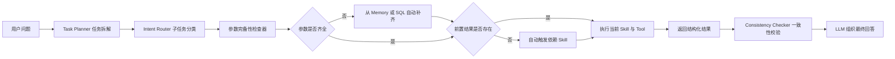
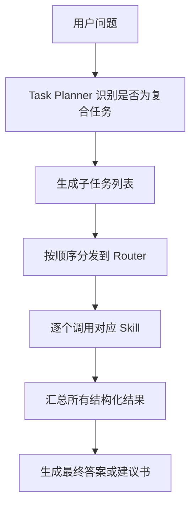
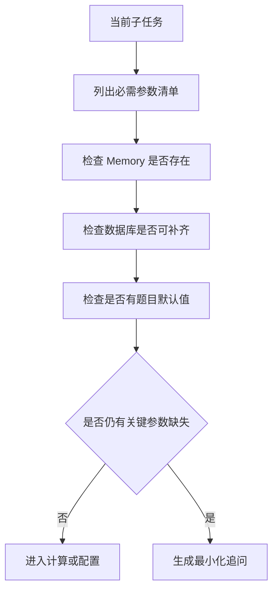
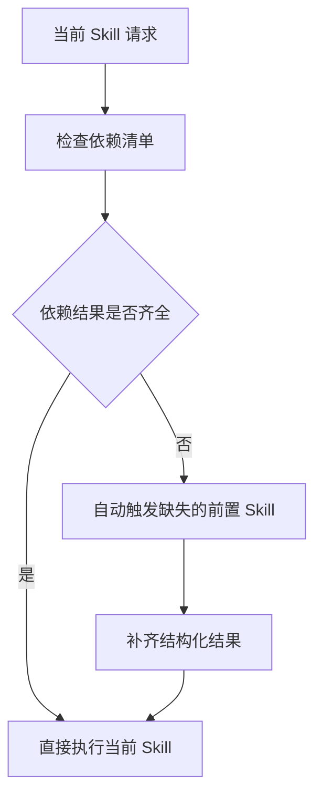
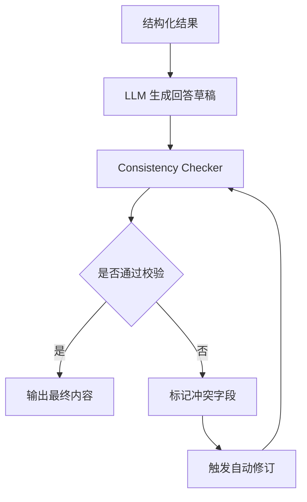

# 任务 2 养老规划 Agent 建设高优先级流程优化方案

## 1. 文档目标

本文档聚焦对当前养老规划 Agent 方案中 4 个高优先级问题的优化设计，目标是进一步提升：

1. `题目契合度`：更贴合赛题要求的养老规划 SOP，而不是只做单点问答。
2. `鲁棒性`：面对复合问题、缺失参数、前置结果缺失、生成内容不一致等情况时依然稳定。
3. `可解释性`：让每一步“为什么这样查、这样算、这样推荐”都有明确来源。
4. `工程可落地性`：在不显著增加时延和 Token 成本的前提下完成增强。

本次仅讨论以下 4 项高优先级优化：

1. 在 `Intent Router` 前增加 `Task Planner`。
2. 增加 `参数完备性检查器`。
3. 增加 `前置条件自动补齐机制`。
4. 增加 `Consistency Checker`。

---

## 2. 为什么需要单独优化这 4 点

当前主方案已经具备 `Router + Skill + Tool + Memory` 的基本框架，能够完成基础查询、行为分析、养老测算、配置建议和建议书生成。

但如果直接进入比赛或评测环境，仍然存在以下风险：

1. 用户可能一次提出多个子任务，单意图路由容易漏步骤。
2. 测算或配置所需参数不完整时，模型可能默认补值，导致偏题或算错。
3. 生成建议书或配置方案时，前序分析结果不一定已经存在。
4. 建议书中的文字、数值、产品名称可能与工具输出不完全一致。

这 4 个问题不一定会在简单样例中暴露，但在复杂、多轮、追问型题目里会直接影响回答质量和稳定性，因此值得单独强化。

---

## 3. 优化总思路

将原有主流程：

```text
用户问题 -> Intent Router -> Skill Dispatcher -> Tool -> LLM 回复
```

升级为：

```text
用户问题
-> Task Planner
-> 参数完备性检查
-> 前置条件补齐
-> Skill Dispatcher
-> Tool 执行
-> Consistency Checker
-> LLM 输出
```

对应的优化后总流程图如下：



这个升级后的流程本质上是把 Agent 从“被动响应单问题”提升为“围绕养老规划任务链主动补步骤”的系统。

---

## 4. 优化点一：增加 Task Planner

### 4.1 问题

当前主方案以 `Intent Router` 为入口，适合处理单一意图问题，例如：

1. “客户 V500001 今年多大”
2. “客户 V500001 养老金缺口是多少”

但比赛中更常见的是复合问题，例如：

1. “先分析客户偏好，再测算养老金缺口，最后给一份配置建议。”
2. “结合前面说的目标，重新算一下缺口，并同步更新建议书。”

这类问题如果直接交给单意图路由，容易出现：

1. 只命中第一个意图，漏掉后续步骤。
2. 虽然命中多个关键词，但无法确定执行顺序。
3. 多轮追问时无法判断应该复用哪些已有结果。

### 4.2 优化设计

在 `Intent Router` 之前增加 `Task Planner`，先由 LLM 将用户问题拆成若干标准子任务，再把每个子任务路由给对应 Skill。

建议 `Task Planner` 输出结构化计划，例如：

```json
{
  "customer_id": "V500001",
  "tasks": [
    {"step": 1, "type": "behavior_analysis"},
    {"step": 2, "type": "retirement_calculation"},
    {"step": 3, "type": "allocation_planning"},
    {"step": 4, "type": "proposal_generation"}
  ]
}
```

### 4.3 执行流程



### 4.4 价值

1. 更贴合养老规划业务 SOP，流程更像真实顾问工作流。
2. 提升复合问题命中率，减少漏答。
3. 让“先分析、再测算、再配置、再成文”的链路更清晰。

---

## 5. 优化点二：增加参数完备性检查器

### 5.1 问题

养老测算和资产配置都依赖较多参数，例如：

1. 客户年龄、性别、风险等级
2. 当前月收入、月支出、净资产
3. 养老金、企业年金
4. 退休年龄目标、退休生活费目标
5. 通胀率、收益率、寿命假设

如果这些参数缺失，模型很容易出现两类问题：

1. 直接按常识补值，导致结果与题目口径不一致。
2. 参数来源混乱，不清楚哪些来自数据库、哪些来自用户偏好、哪些来自默认值。

### 5.2 优化设计

在执行 `Retirement Calculation Skill` 或 `Allocation Planning Skill` 之前，增加一层 `参数完备性检查器`。

该模块负责输出 4 类判断：

1. `已具备参数`
2. `可自动补齐参数`
3. `可采用默认值参数`
4. `必须追问用户参数`

建议输出结构化清单：

```json
{
  "ready_params": {
    "age": 22,
    "gender": "男",
    "monthly_expend": 4000
  },
  "fillable_from_memory": ["retirement_goal_amount"],
  "fillable_from_default": ["inflation_annual", "life_expectancy"],
  "must_ask_user": []
}
```

### 5.3 执行流程



### 5.4 关键设计原则

1. `数据库优先`
   客观事实优先从 SQL 查询获取，不允许模型自由猜测。
2. `默认值显式化`
   若使用题目默认假设，必须在结构化结果中记录。
3. `最小化追问`
   只有核心参数缺失且无法补齐时才追问，避免影响时延。

### 5.5 价值

1. 明显降低“模型偷偷补值”的风险。
2. 保证测算口径统一，更符合比赛评分要求。
3. 为后续解释和建议书引用提供可靠来源。

---

## 6. 优化点三：增加前置条件自动补齐机制

### 6.1 问题

有些业务天然依赖前序结果：

1. 资产配置依赖客户画像、行为偏好和养老金缺口。
2. 投资建议书依赖画像、偏好、测算结果和配置结果。

如果系统假设这些结果已经存在，就容易在以下场景失败：

1. 用户第一次上来就要“直接生成建议书”。
2. 用户先问配置方案，但此前还没做缺口测算。
3. 某次会话中间结果未缓存成功，后续步骤找不到依赖。

### 6.2 优化设计

为每个 Skill 定义 `依赖清单`，当当前 Skill 执行前发现依赖缺失时，自动补跑前置 Skill，而不是直接报错或要求用户重述。

示例依赖关系：

1. `behavior_analysis`
   无强依赖，只需 `customer_id`
2. `retirement_calculation`
   依赖 `profile`
3. `allocation_planning`
   依赖 `profile + behavior_analysis + retirement_calculation`
4. `proposal_generation`
   依赖 `profile + behavior_analysis + retirement_calculation + allocation_planning`

### 6.3 执行流程



### 6.4 示例

若用户直接说：

`请为客户 V500001 生成一份完整养老投资建议书。`

系统不应直接进入文案生成，而应自动执行：

1. `skill_customer_profile`
2. `skill_behavior_analysis`
3. `skill_retirement_calculation`
4. `skill_allocation_planning`
5. `skill_proposal_writer`

### 6.5 价值

1. 用户体验更自然，不需要用户了解系统内部顺序。
2. 更贴合真实业务流程，避免“建议书无依据”。
3. 降低多轮对话中的状态缺失问题。

---

## 7. 优化点四：增加 Consistency Checker

### 7.1 问题

即使前面的 SQL、计算和配置都正确，最终输出阶段仍然可能出现不一致：

1. 建议书中的金额和测算引擎返回值不一致。
2. 推荐产品名称超出题目产品库。
3. 风险等级为 `R1`，却出现权益类产品建议。
4. 前文说客户关注流动性，后文建议却几乎全配长期低流动性产品。

这类问题在“看起来很像正确答案”的情况下尤其危险，因为人工一眼能看出不严谨。

### 7.2 优化设计

在 LLM 输出最终答案前，增加 `Consistency Checker`，对结构化结果与文案草稿进行一致性校验。

建议至少检查以下 4 类内容：

1. `数值一致性`
   文案中的关键金额、比例、年限是否与工具输出完全一致。
2. `产品一致性`
   提到的产品是否均属于题目给定产品库。
3. `风险一致性`
   推荐组合是否满足客户风险等级和生命周期约束。
4. `关注点一致性`
   建议书是否显式回应前序对话中的关注点。

### 7.3 执行流程



### 7.4 建议校验规则

可用规则引擎或程序校验，不建议仅靠大模型自查。

示例规则：

1. 若文案中提取出的 `gap` 与测算结果 `gap` 不等，则不通过。
2. 若推荐产品不在 `{现金理财, 定期存款, 短债类产品, 固收+产品, 权益类产品, 年金险}` 中，则不通过。
3. 若 `risk_level=R1` 但文案中含 `权益类产品`，则不通过。
4. 若 `Preference Memory.focus_points` 非空，但建议书未覆盖任何关注点，则不通过。

### 7.5 价值

1. 直接提升最终答案的严谨性和可信度。
2. 尤其适合建议书类高分题型。
3. 能把“工具正确但文案走样”的问题拦截在输出前。

---

## 8. 四项优化后的推荐总架构

建议将当前系统升级为如下架构：

```text
用户问题
  ↓
Task Planner
  ↓
Intent Router
  ↓
Parameter Completeness Checker
  ↓
Prerequisite Resolver
  ↓
Skill Dispatcher
  ├─ Customer Profile Skill
  ├─ Behavior Analysis Skill
  ├─ Retirement Calculation Skill
  ├─ Allocation Planning Skill
  └─ Proposal Writer Skill
  ↓
Tools
  ├─ SQL Generator + SQL Executor
  ├─ Session Memory Tool
  ├─ Retirement Calculator Tool
  ├─ Product Mapping Engine
  └─ Allocation Engine
  ↓
Consistency Checker
  ↓
Answer Composer / Proposal Generator
  ↓
最终回复
```

---

## 9. 实施优先级建议

如果时间有限，建议按以下顺序落地：

1. `Task Planner`
   先解决复合问题漏步骤的问题。
2. `参数完备性检查器`
   先把数值链路的输入稳定住。
3. `前置条件自动补齐`
   让复杂问题可以自动串起完整分析链路。
4. `Consistency Checker`
   最后拦截输出阶段的不一致问题。

原因是前 3 项主要提升“能不能稳定做对”，第 4 项主要提升“最后呈现是否足够严谨”。

---

## 10. 预期收益

完成这 4 项增强后，系统将从“能回答养老规划问题”进一步提升为“能按养老规划业务流程稳定完成任务”，预期收益包括：

1. `题目契合度更高`
   更像围绕 KYC、缺口测算、资产配置和建议书生成的完整 Agent。
2. `复杂问题成功率更高`
   尤其是复合问题、多轮追问和建议书类题目。
3. `数值和结论更稳`
   降低参数缺失、隐式补值、前后不一致等风险。
4. `解释性更强`
   每一步都能说明来源、依赖和约束。

从比赛视角看，这 4 项增强非常契合“回答质量、耗时、Token 消耗”三项综合指标：它们不是单纯增加推理链路，而是通过更强的流程控制减少返工、漏答和幻觉。
